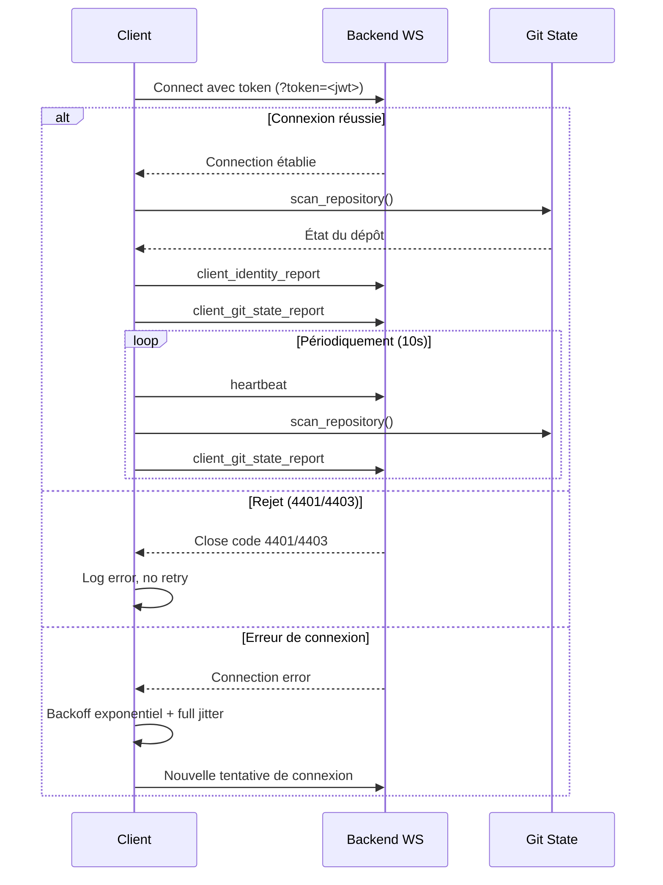
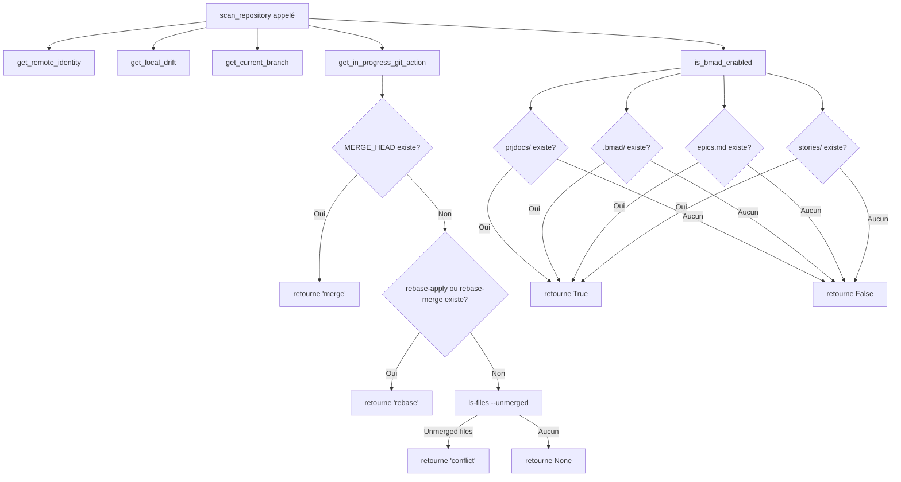

# Guide d'Utilisation - Client Python bmad-portal

## Vue d'Ensemble

Le client Python de bmad-portal est un agent CLI conçu pour se connecter au backend bmad-portal via WebSocket et rapporter l'état local du dépôt Git, ainsi que pour envoyer des heartbeats (signaux de présence) réguliers.

### Informations du Projet

| Champ | Valeur |
|-------|--------|
| **Nom du projet** | client (bmad-portal client agent) |
| **Version** | 0.1.0 |
| **Version Python requise** | >=3.13,<3.14 |
| **Dépendance principale** | `websockets>=17,<18` |
| **Outils de dev** | `pytest>=9.1.1`, `ruff>=0.16.1` |

---

## Installation

### Prérequis

1. **Python 3.13** ou supérieur (mais < 3.14)
2. **uv** ou **pip** pour la gestion des paquets
3. Un environnement virtuel Python activé

### Configuration de l'environnement

1. Clonez le dépôt du client :
   ```bash
   cd client
   ```

2. Créez et activez un environnement virtuel (si ce n'est pas déjà fait) :
   ```bash
   python3 -m venv .venv
   source .venv/bin/activate
   ```

3. Installez les dépendances :
   ```bash
   # Si vous utilisez uv
   uv sync

   # Ou avec pip
   pip install -e .
   ```

4. Installez les dépendances de développement (pour les tests) :
   ```bash
   pip install -e ".[dev]"
   ```

---

## Configuration des Variables d'Environnement

Le client Python utilise les variables d'environnement suivantes. Copiez le fichier `.env.example` en `.env` ou définissez ces variables dans votre shell avant d'exécuter l'agent :

| Variable | Description | Valeur par défaut |
|----------|-------------|-------------------|
| `BACKEND_WS_URL` | Point de terminaison WebSocket du backend | `ws://localhost:8000/ws` |
| `HEARTBEAT_INTERVAL_SECONDS` | Intervalle entre les messages heartbeat en secondes | `10` |
| `BMAD_AUTH_TOKEN` | Jeton Bearer pour authentifier la connexion WebSocket | *Non défini* |

> **Note importante :** Le fichier `.env` n'est pas chargé automatiquement par `agent/realtime.py`. Vous devez exporter ces variables dans votre shell (ou utiliser un outil comme `direnv`) avant d'exécuter le client agent.

### Exemple de configuration shell :

```bash
export BACKEND_WS_URL="ws://localhost:8000/ws"
export HEARTBEAT_INTERVAL_SECONDS="10"
export BMAD_AUTH_TOKEN="votre_jeton_jwt_ici"
```

---

## Utilisation

### Mode de vérification de démarrage (Boot-Check)

Dans la version 0.1.0 (Story 0.1), l'agent CLI effectue une vérification de démarrage : il se lance, imprime une ligne d'état, et se ferme proprement.

```bash
python -m agent.main
```

**Sortie attendue :**
```
bmad-portal client agent v0.1.0: ok
```

**Code de sortie :** `0` (succès)

---

## Architecture du Client

### Composants Principaux

#### 1. `agent/main.py` - Point d'entrée CLI

Ce module sert de point d'entrée pour l'agent client CLI.

**Fonctionnalités :**
- Impression de la version et du statut
- Retour du code de sortie 0 en cas de succès

#### 2. `agent/realtime.py` - Client WebSocket reconnectable

Ce module gère la connexion persistante au point de terminaison `/ws` du backend.

**Fonctionnalités principales :**

| Fonction | Description |
|----------|-------------|
| `connect_and_run()` | Maintient une connexion WebSocket persistante et authentifiée |
| `_send_heartbeats()` | Envoie un message `{"type": "heartbeat"}` à l'intervalle spécifié |
| `_receive_messages()` | Lit et journalise les messages entrants |
| `_sync_state_reporter()` | Analyse périodiquement le dépôt et envoie les rapports d'état Git |
| `_send_git_state_report()` | Envoie un rapport d'état Git via le format d'enveloppe `client_git_state_report` |
| `_send_client_identity_report()` | Envoie un rapport d'identité client via le format d'enveloppe `client_identity_report` |

**Reconnexion avec backoff exponentiel :**

En cas d'erreur de connexion ou de fermeture inattendue, le client se reconnecte avec un backoff exponentiel et un "full jitter" :
- **Base backoff :** 1.0 seconde
- **Facteur de backoff :** x2
- **Backoff maximal :** 30.0 secondes

**Codes de rejet fataux :**

Le client ne tente pas de se reconnecter si le backend ferme la connexion avec les codes suivants :
- `4401` - Non autorisé (unauthorized)
- `4403` - Origine interdite (forbidden origin)
- `401` / `403` - Codes de statut de handshake invalides

#### 3. `agent/git_state.py` - Détection de l'état Git

Ce module scanne un dépôt Git local et détecte :

| Fonction | Description |
|----------|-------------|
| `get_remote_identity()` | Extrait l'identité du dépôt distant (format : `git@github.com:org/repo.git` ou `https://github.com/org/repo.git`) |
| `get_local_drift()` | Retourne les compteurs `ahead` et `behind` par rapport au branche distante de suivi |
| `get_in_progress_git_action()` | Détecte les actions Git en cours : `"rebase"`, `"merge"`, `"conflict"`, ou `None` |
| `is_bmad_enabled()` | Vérifie la présence de marqueurs BMad (`prjdocs/`, `.bmad/`, `epics.md`, `stories/`) |
| `scan_repository()` | Retourne un dictionnaire d'état complet du dépôt Git |
| `get_current_branch()` | Retourne le nom de la branche actuelle |

**Format du rapport d'état Git (`client_git_state_report`) :**

```json
{
  "type": "client_git_state_report",
  "technical_identifier": "git@github.com:org/repo.git",
  "branch": "main",
  "ahead": 2,
  "behind": 1,
  "in_progress_action": "none",
  "is_bmad_enabled": true
}
```

**Format du rapport d'identité client (`client_identity_report`) :**

```json
{
  "type": "client_identity_report",
  "technical_identifier": "git@github.com:org/repo.git"
}
```

---

## Exécution des Tests

Pour exécuter la suite de tests du client :

```bash
# Avec pytest
pytest tests/ -v

# Avec ruff pour la vérification du code
ruff check .

# Formatage avec ruff
ruff format .
```

### Couverture des Tests

Les tests incluent :

| Fichier de test | Couverture |
|-----------------|------------|
| `test_main.py` | Vérifie que le point d'entrée CLI imprime une ligne d'état et retourne 0 |
| `test_realtime.py` | Tests du client WebSocket : heartbeat périodique, reconnexion avec backoff, fermeture de connexion, événement stop, codes de fermeture fatals |
| `test_git_state.py` | Tests de détection Git : identité distante, divergence locale, actions en cours (merge, rebase, conflict), marqueurs BMad, structure du rapport complet |

---

## Flux de Travail

### Diagramme de Connexion WebSocket



### Logique de Détection Git



---

## Dépannage

### Problème : Échec d'authentification WebSocket

**Symptôme :** Le client logue un rejet avec le code `4401` ou `4403`.

**Solutions :**
1. Vérifiez que `BMAD_AUTH_TOKEN` est défini et valide
2. Obtenez un nouveau token en utilisant `POST /auth/login` (voir le fichier CONTRIBUTING.md du dépôt principal)
3. Vérifiez que l'origine de la connexion est autorisée par le backend

### Problème : Timeout des commandes Git

**Symptôme :** Les commandes Git semblent hanging ou retournent un timeout.

**Solutions :**
1. Les commandes Git ont un timeout de 30 secondes intégré
2. Vérifiez qu'il n'y a pas de hooks Git bloquants (`HUSKY=0` est défini)
3. Vérifiez la santé du dépôt Git local

### Problème : Échec de la détection de la branche distante

**Symptôme :** `ahead` et `behind` sont toujours `0` même s'il y a des commits locaux.

**Solutions :**
1. Vérifiez que la branche locale a une branche de suivi configurée : `git branch --set-upstream-to=origin/<branche>`
2. Vérifiez que le remote `origin` est correctement configuré : `git remote -v`

---

## Historique des Versions

### Version 0.1.0

- Point d'entrée CLI initial avec vérification de démarrage (boot-check)
- Impression de la version et du statut
- Code de sortie 0 en cas de succès
- Structure prête pour l'intégration WebSocket (Story 2.1/2.2)

---

## Références

- **Backend WebSocket Endpoint :** `/ws`
- **Format des messages WebSocket :** Enveloppes avec champ `type` (`heartbeat`, `client_git_state_report`, `client_identity_report`)
- **Authentification :** Token JWT passé en paramètre de requête `?token=<jwt>`
