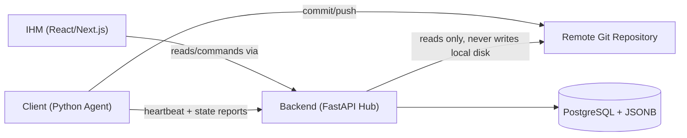
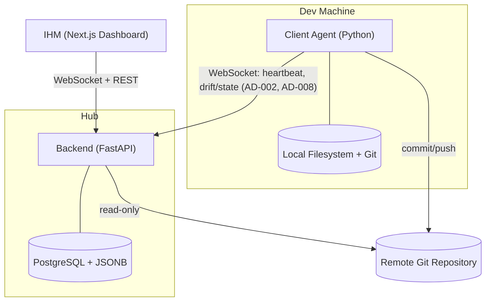
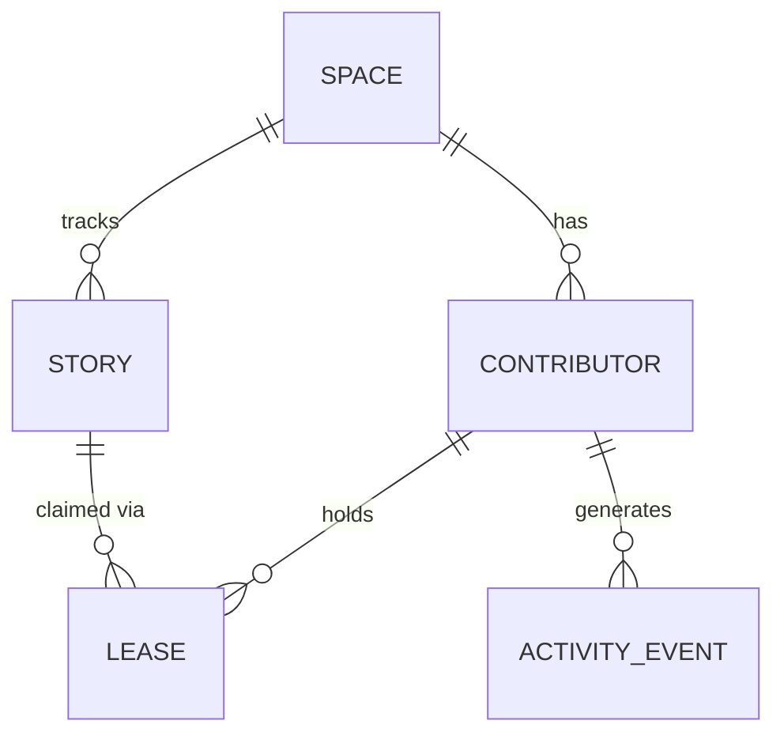

# Architecture Spine — BMad Portal (Hub)

## Design Paradigm

**Distributed Command & Centralized State.** Authority is split three ways, and no unit may act outside its lane:
- **Local Authority — Client (Agent):** owns the local filesystem and all Git operations. Nothing else writes to disk on the developer's machine.
- **Orchestration Authority — Backend (Hub):** owns temporal state (leases, claims, presence, space lifecycle) and the deterministic artifact index. Does **not** own a semantic/AI knowledge graph in MVP (deferred, see below).
- **Truth Authority — Remote Git Repository:** the final arbiter of all committed artifacts; also the platform's identity anchor (a space's identity *is* its remote repo path).

## Invariants & Rules

### 1. Distributed Synchronization & Claims

### AD-002 — Lease-based Heartbeat [ADOPTED]

- **Binds:** FR11, FR12, FR16 — claim/lease lifecycle for User Stories.
- **Prevents:** Zombie claims surviving a client disconnect; two contributors double-claiming the same story.
- **Rule:** A claim on a User Story is a time-limited lease issued by the Backend. The Client must maintain an active WebSocket heartbeat; if it ceases for **> 60s**, the Backend automatically expires the lease and marks the story available. A rejected claim or detected conflict automatically signals the Client to re-sync (Auto-Healing Sync).

### AD-005 — Client-side Git Authority [ADOPTED]

- **Binds:** all — filesystem/Git access boundary.
- **Prevents:** The Backend needing (or gaining) direct local filesystem access; split-brain writes to a developer's working tree.
- **Rule:** The Backend never writes directly to a user's local disk. Every local change is proposed via the Client Agent, which alone performs the local Git commit/push.

### 2. Data & Artifact Indexing

### AD-006 — MVP Data Layer: relational + JSONB only [ADOPTED]

- **Binds:** all — Backend persistence.
- **Prevents:** Premature pgvector/embedding wiring for a Copilot that isn't in scope; conflating the artifact-traceability graph with the deferred AI Knowledge Graph.
- **Rule:** MVP persistence is PostgreSQL, relational tables + JSONB for artifact metadata (Users, Roles, Leases, Spaces, Contributors). No `pgvector` / vector store until the AI Copilot is picked back up. The graph-based indexing needed for artifact traceability (FR1–FR3) is a plain edge/adjacency model inside this same PostgreSQL store — it is **not** the deferred AI Knowledge Graph and must not be built to depend on it.

### 3. Onboarding, Identity & State Reporting

### AD-007 — Zero-Setup Onboarding & Space Identity [ADOPTED]

- **Binds:** FR7, FR8, FR9 — Client bootstrap, Backend space provisioning.
- **Prevents:** Two Clients disagreeing on what identifies a space (short name vs. full path) and colliding; two concurrent first-contacts creating duplicate spaces for one identity; a space silently failing to appear when the Backend lacks repo access; an undefined access-recovery path leaving Backend and IHM disagreeing on state.
- **Rule:** A space's technical identifier is the full remote Git path (`host/org/repo`) — never the short name, which is display-only and gets an org badge/tooltip *only* when two spaces share it. Space creation is an **atomic upsert keyed on that identifier** (unique constraint) — concurrent first-contact reports from multiple Clients for the same identity must resolve to exactly one space, never a race. The first Client reporting an unrecognized identity triggers that creation; subsequent Clients with the same identity auto-join — there is no manual "create space" step. Space status is one of `pending | active | access_revoked`. If the Backend lacks read access at creation time, status is `pending` and the connecting developer gets an actionable, provider-scoped access-grant link (generic text fallback if the provider can't be determined) — never a silent failure. A revoked space (`access_revoked`) that regains access transitions back to `pending` for re-verification, **never directly to `active`** — first grant and re-grant share the same access-check path.

### AD-008 — Local Repo State Reporting: one stream, one canonical read model [ADOPTED]

- **Binds:** FR4, FR10, FR20 — Client state reporting, contributor status display, Risk & Quality Signals.
- **Prevents:** The contributor-status UI and the risk-signal engine each deriving Git drift independently and disagreeing during a propagation window; each consumer inventing its own staleness threshold.
- **Rule:** The Client reports local Git drift and in-progress actions (rebase/merge/conflict) as a **single stream**, piggybacked on the AD-002 WebSocket heartbeat channel: pushed immediately on local Git hook events, with a 10s (configurable) safety-tick fallback. The Backend maintains exactly **one canonical, monotonically-versioned "latest known state" record per contributor** from this stream; every consumer — contributor-status UI, Risk & Quality Signals, Status Pill — reads that same canonical record, never an independent projection with its own batching or cache. A record older than **30s** is stale: consumers show "Last known — {time}" instead of silently serving it as current — one threshold, shared by every surface.

### AD-009 — Contributor status is two orthogonal signals [ADOPTED]

- **Binds:** FR14, FR15 — Dashboard, Contributor Detail, Claim Management surfaces; the Backend contributor model, the WebSocket/API payload, and the Status Pill component (UX-DR5).
- **Prevents:** One surface folding "absent" into a combined sync-state enum while another keeps presence separate, producing payloads that can't be reconciled; a builder satisfying the payload shape while still storing the two signals as one merged value internally, so concurrent presence/sync-state updates race and silently overwrite each other.
- **Rule:** **presence** (`connected | absent`) and **sync-state** (`synced | drift | conflict | syncing-active | claimed`) are two independently-updatable fields in the Backend data model — not a derived split of one stored value — so each updates without a read-modify-write on the other. They are carried as two separate fields in every WebSocket/API payload. Multi-axis surfaces (Contributor Detail, Dashboard) render both independently. The single-glyph **Status Pill** (UX-DR5, FR14's 6-value palette) is the one specified collapse of the two axes, by fixed precedence: **if `presence = absent`, the Pill shows `Idle-Offline` regardless of sync-state; otherwise the Pill shows the sync-state value** (Synced/Drift/Conflict/Syncing-Active/Claimed). No other surface may invent a different collapse rule.

## Consistency Conventions

| Concern | Convention |
| --- | --- |
| Identity | Space identity = full remote Git path (`host/org/repo`), never the short display name (AD-007). |
| Status modeling | Presence and sync-state are always separate, independently-updatable fields — in storage and in payload — never merged; the Status Pill's `absent → Idle-Offline` precedence is the only sanctioned collapse (AD-009). |
| State reporting | Any new consumer of Git-drift/in-progress-action data reads AD-008's one canonical per-contributor record — it does not open a new reporting path or its own projection/cache. Staleness cutoff is 30s everywhere. |
| Auditability | Every critical state transition (claims, lease expiry, sync events, space status change) is logged to `.memlog.md` for a human-readable, verifiable history. |
| AI content (when §Deferred AI work resumes) | Any AI-generated content is staged `[DRAFT]`; promotion to `[COMMITTED]` requires explicit human action — never re-derive this rule without also reinstating AD-003/AD-004. |

## Stack

| Name | Version |
| --- | --- |
| Python (Client agent, Backend) | 3.13 |
| FastAPI (Backend) | 0.141.x |
| PostgreSQL | 18.x |
| Next.js (IHM) | 16.3 |
| React (IHM) | 19.x |
| Charting (IHM) | Recharts or D3 — final pick deferred to IHM implementation |

## Structural Seed

## Capability → Architecture Map

| Capability / Area | Lives in | Governed by |
| --- | --- | --- |
| Project Scaffolding & Dev Environment (Epic 0, no numbered FR) | All 3 tiers (repo structure, local dev config), initial PostgreSQL migrations, CI (lint + tests) | Stack (this doc); deployment topology stays out of scope, see Deferred |
| Authentication & RBAC Foundation (Epic 0 / Story 0.2, no numbered FR) | Backend (session + RBAC enforcement substrate) | Identity/Auth RBAC (paradigm); provider choice and full role→permission matrix deferred, see Deferred below |
| Zero-Setup Onboarding (FR7–FR9) | Client bootstrap + Backend space provisioning | AD-007 |
| Local Repo State Reporting (FR4, FR10) | Client → Backend WebSocket stream | AD-008 |
| Lease/Claim management (FR11, FR12, FR16) | Backend | AD-002 |
| Dashboard, Contributor Detail, Claim Management (FR13–FR15) | IHM | AD-009 (status model), AD-008 (data source) |
| Risk & Quality Signals (FR20, FR21) | Backend, fed by AD-008 stream | AD-008, AD-006 |
| Artifact indexing & Traceability Matrix (FR1–FR3) | Backend | AD-006 |
| Sprint & Ceremony Dashboard (FR17–FR19) | Backend (deterministic burn-down/velocity from artifacts + Git activity), IHM | AD-006 (data source); read-only deterministic display, no new cross-unit divergence risk |
| System Administration (FR22) | Backend (RBAC enforcement), IHM (Admin-only surface) | Identity/Auth RBAC (paradigm); role→permission detail deferred below |

## Deferred

- **AI Copilot (Draft-mode, Graph-RAG, Actor-Critic audit) — ex-AD-003, ex-AD-004:** Pushed to Post-MVP by the 2026-08-05 PRD amendment (§7). Their prior Rules — AI never performs deterministic-core actions autonomously; all AI content is `[DRAFT]` until explicit human commit; every RAG reasoning step carries `{file_path, git_hash, line_range}` provenance — stand as the reinstatement spec when that work resumes; they do not bind MVP builders now. The `AD-003`/`AD-004` ids are retired, not reused.
- **`pgvector` / vector store:** deferred with the AI Copilot (AD-006 supersedes for MVP scope).
- **Charting library final choice (Recharts vs. D3):** left to IHM implementation; both satisfy the real-time charting requirement, no cross-unit divergence risk.
- **Deployment & environments (K8s vs. serverless, provider topology):** not yet decided — no infra requirement has surfaced from PRD/UX; revisit before the first deployable build.
- **RBAC role-to-permission matrix detail:** Identity/Auth is RBAC-based (Backend-owned) per the original spine, and the enforcement substrate (session + role attached to every request, protected routes reject unauthenticated calls) is built in Epic 0 / Story 0.2 — not deferred. What remains deferred to implementation is the *concrete identity provider* (SSO vs. email/password vs. other) and the *full role→permission mapping*; whatever it resolves to must still satisfy the existing UX contract that non-Admin roles get the System Administration nav item fully hidden (not disabled) and every gated action is RBAC-checked before it becomes a next-action option. Not a cross-unit divergence risk at this altitude since MVP has exactly one gated role (Admin).
